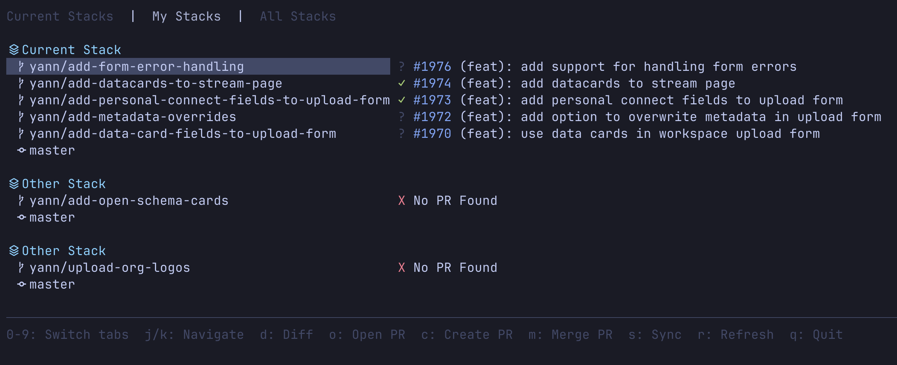

# PrStack

A VCS-agnostic CLI and TUI app for effortless PR stack management that embraces the chaos of day-to-day development.

## What is PrStack?

PrStack dynamically discovers your PR stacks by tracing from your current branch back to trunk. No manual configuration, no rigid structures - just work naturally and let PrStack handle the rest.

## Quick Example

```bash
# Create your branches naturally
jj new -m "Feature A"
jj bookmark create feature-a

jj new -m "Feature B"
jj bookmark create feature-b

# Sync discovers: feature-b → feature-a → main
prstack sync
```

PrStack will:
- Discover your stack automatically
- Update and rebase on trunk
- Create PRs with correct base branches
- Keep everything in sync

## Key Features

- **Dynamic Stack Discovery**: No pre-configuration needed - PrStack figures out your stack on the fly
- **TUI & CLI**: Interactive terminal UI or scriptable commands
- **VCS Agnostic**: Works with Jujutsu (Git support coming soon)
- **Adaptive**: Switch branches and PrStack adapts to your new context

## Installation

**Requirements**: [Babashka](https://babashka.org/) and [GitHub CLI](https://cli.github.com/)

```bash
git clone https://github.com/yannvanhalewyn/prstack.git
cd prstack
chmod +x bin/prstack
ln -s $(pwd)/bin/prstack /usr/local/bin/prstack
```

## Documentation

Full documentation is available at: **[your-docs-url-here]**

- [Getting Started](your-docs-url/docs/getting-started/quickstart)
- [Philosophy](your-docs-url/docs/philosophy) - How PrStack differs from Git Machete and Graphite
- [Commands Reference](your-docs-url/docs/commands/sync)
- [Configuration](your-docs-url/docs/configuration)

## Why PrStack?

Traditional PR stack tools require upfront planning and rigid adherence to predefined structures. PrStack recognizes that development is organic - branch anywhere, pivot freely, and let the tool adapt to you.

**Work the way you think. Let PrStack handle the rest.**
